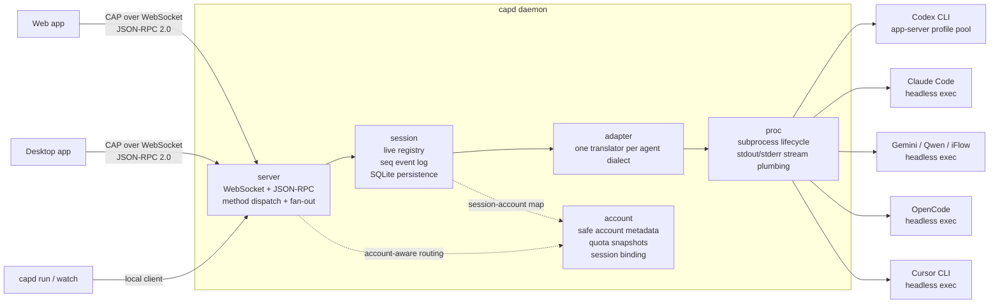
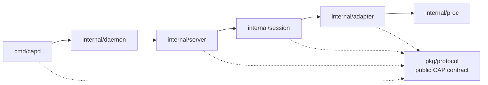
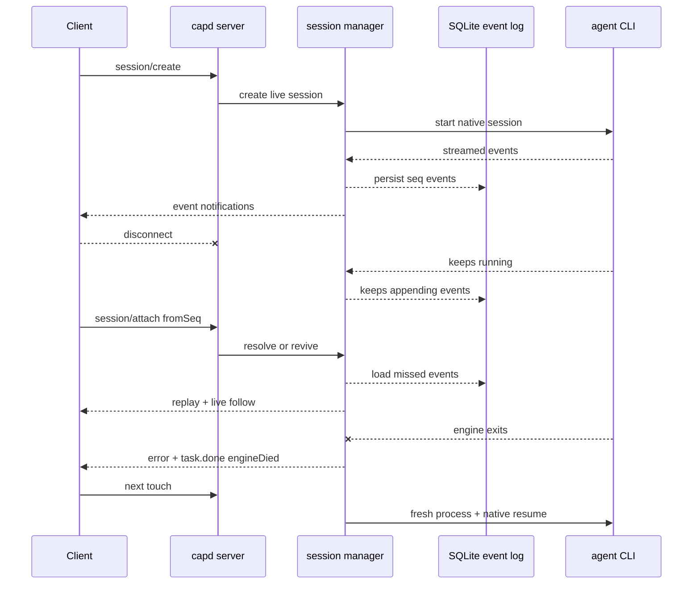
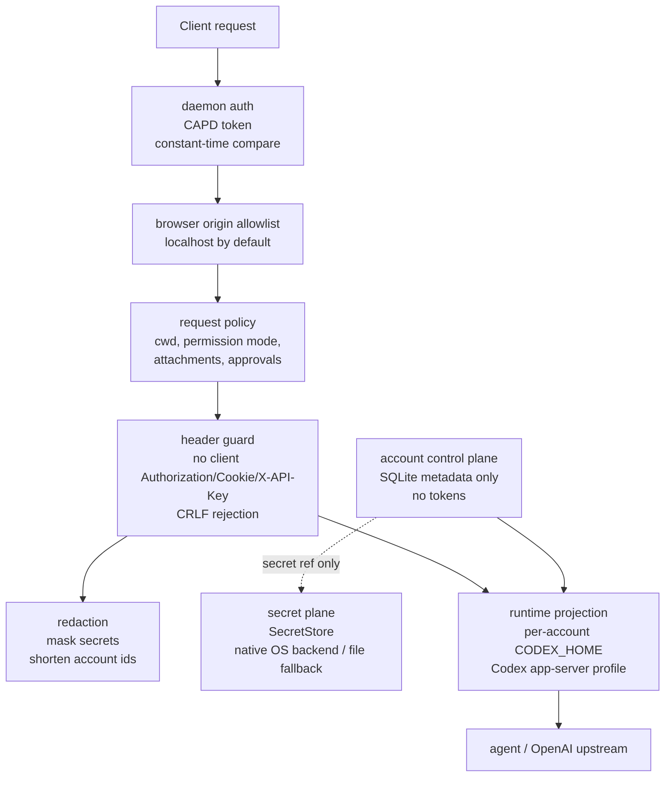

# capd

**One protocol to drive every coding agent CLI.**

capd is the Coding Agent Protocol (CAP) daemon. It runs on your machine,
discovers the coding agent CLIs you have installed — Codex, Claude Code,
Gemini CLI, OpenCode, Cursor CLI, and more — and exposes them to web,
desktop, and terminal clients through a single WebSocket + JSON-RPC 2.0
interface.

Every agent CLI speaks its own dialect: different flags, session models, and
streaming formats. capd translates all of them into one unified protocol, so
a client written once can drive any agent.

## Architecture at a glance



The dependency direction stays one-way:



## Why capd

- **Write once, drive any agent.** One client codebase for Codex, Claude
  Code, Gemini, OpenCode, Cursor — and forks like Qwen Code, iFlow, and
  CodeBuddy ride the same translators.
- **Sessions that refuse to die.** Client disconnects, daemon restarts, and
  even agent-engine crashes never lose a conversation: events are sequence-
  numbered and persisted, and sessions revive with their native context.
- **Real control, not fire-and-forget.** Stream output token by token, steer
  a running turn, cancel instantly, and approve or deny each dangerous action
  from any client.
- **Tiny footprint.** A single CGO-free binary; ~18 MB resident as a daemon.

## Install

Download a release archive for your platform from
[Releases](https://github.com/codingagentprotocol/capd/releases), or build
from source:

```bash
go install github.com/codingagentprotocol/capd/cmd/capd@latest
```

Run it in the foreground, or install it as a user-level service
(launchd / systemd / Windows SCM — starts on boot, restarts on crash,
never runs as root):

```bash
capd start --secret-backend native                                  # foreground
capd service install --secret-backend native && capd service start  # persistent
# or: CAPD_SECRET_BACKEND=native capd service install && capd service start
```

The local web console is served by the daemon at
`http://127.0.0.1:7777/console/`. Open it with `capd console`; for the compact
data validation page, use `capd console --probe`. The command passes the daemon
token to the browser without printing it to the terminal. The probe also calls
`/probe/data` with `Authorization: Bearer ...` to fetch machine-readable,
secret-redacted health, account, quota, and route diagnostics.

## Quick start

```bash
capd agents list      # which agent CLIs does this machine have?

cd ~/your-project
capd run "explain the structure of this repo"
```

`capd run` streams the agent's work to your terminal: typewriter output,
each command it executes, and interactive approval prompts:

```
session s_824067bfb24f2c25 (codex)
⏵ /bin/zsh -lc 'ls -la'
⚠ approval needed (command): rm -rf build/
  allow? [y]es / [a]lways / [N]o: y
✓ done
(continue with: capd run --session s_824067bfb24f2c25 "...")
```

Useful flags and companions:

```bash
capd run --agent opencode "..."             # pick the agent
capd run --agent codex --account codex-acct # use an imported Codex account
capd run --agent codex --account auto --require-fresh-quota "..." # quota-aware Codex account
capd run --model gpt-5.3-codex --effort high "..."
capd run --permission acceptEdits "..."     # default | acceptEdits | full
capd run --image diagram.png "what's wrong in this architecture?"
capd run --session s_xxx "follow-up..."     # multi-turn, survives restarts

capd sessions             # all sessions: live / stored / ended
capd watch s_xxx          # re-join a long-running task: replay + follow
capd agents usage codex   # plan, rate-limit windows, reset times
capd agents usage codex --account codex-acct
capd agents usage codex --account auto
capd agents route --account auto --require-fresh-quota --json

capd accounts codex import   # import local ~/.codex/auth.json into capd
capd accounts codex import --auth /tmp/a/auth.json --auth /tmp/b/auth.json # batch import explicit paths
CAPD_CODEX_AUTH_PATHS="/tmp/a/auth.json:/tmp/b/auth.json" capd accounts codex import # batch import on macOS/Linux
capd accounts codex list --json # imported accounts, current marker, safe secret backend and quota metadata
capd accounts codex project  # create a per-account CODEX_HOME projection
capd accounts codex migrate-secrets --from file --to native --dry-run # preview moving older imports to native SecretStore
capd accounts codex migrate-secrets --from file --to native --timeout 2m # update account secret refs after writing native secrets
capd accounts codex quota    # refresh quota and print a safe summary
capd accounts codex quota auto
CAPD_SECRET_BACKEND=native capd accounts --secret-backend native codex quota all --timeout 2m
CAPD_SECRET_BACKEND=native capd accounts --secret-backend native codex smoke --json --quota --require-multiple --require-fresh-quota --require-all-fresh-quota --require-secret-backend native --timeout 2m
CAPD_SECRET_BACKEND=native capd secretstore check --json --roundtrip --require-backend native --timeout 2m # verify native SecretStore directly
CAPD_SECRET_BACKEND=native capd doctor --json --fail --verify-secretstore --require-secret-backend native --timeout 2m # readiness gate
capd start --secret-backend native # keep running in another terminal for CAP/WebSocket checks
capd console --probe --require-secret-backend native # simple web data probe; opens with daemon token without printing it
capd probe data --json --readiness --require-secret-backend native --timeout 2m --fail # same probe diagnostics for automation
curl -H "Authorization: Bearer $(cat ~/.capd/token)" http://127.0.0.1:7777/probe/data # safe JSON diagnostics
capd health --json --require-secret-backend native # confirm daemon /healthz plus version/protocol/secret backend
capd accounts import --auth /tmp/a/auth.json --auth /tmp/b/auth.json # daemon-side CAP import
capd accounts check --json   # daemon-side accounts/check smoke evidence with compact summary
capd accounts check --json --readiness # daemon-side multi-account readiness gate
capd agents route --account auto --require-fresh-quota
```

For deterministic local regression, run `make verify`; for native SecretStore
coverage, run `make verify-secretstore`; for a no-real-account Codex
multi-account quota/routing/readiness regression, run
`make verify-codex-readiness-sim`. `capd doctor --json --fail --timeout 2m` is a safe
readiness audit for live Codex work: it checks daemon health, Codex CLI
availability, imported account count, per-account SecretStore credential
readability, quota freshness, auto-route freshness, the active SecretStore
backend, and daemon-side CAP `accounts/check` reachability without printing
token material. Add `--verify-secretstore` before native live runs to write,
read, and delete a diagnostic secret in the active backend. When
accounts are missing, use
`capd accounts import --auth ...` to exercise the same daemon-side CAP path as
the Web Console. Use `capd accounts check --json --readiness` for the
daemon-side refresh-and-verify gate after fixing quota or account issues. After
importing multiple Codex accounts and starting `capd start` with the same
backend in another terminal, `make live-codex-preflight` verifies SecretStore,
refreshes every Codex quota, runs doctor against fresh local evidence, then
checks daemon/Web quota/routing/readiness without sending a prompt. `make
live-codex-readiness` runs the same preflight and then sends the final live
prompt. Override the final prompt with
`LIVE_PROMPT="..." make live-codex-readiness`; override the backend only for
intentional testing with `LIVE_SECRET_BACKEND=file`. The target runs every live
command with the same `CAPD_SECRET_BACKEND` value, and the daemon-side
readiness step uses `capd accounts check --json --readiness`, so failing gates
still print safe partial evidence and a compact `summary` under `data` for
quota, account, and SecretStore diagnostics.
`capd health --json --require-secret-backend <file|native>` reads
`/healthz?format=json` where available, so live preflight output also captures
the daemon version, protocol version, and active SecretStore backend without
exposing token material, and fails early if the daemon was started with the
wrong backend.
`capd secretstore check --roundtrip --require-backend <file|native> --timeout 2m` is the
smallest direct SecretStore gate: it opens the selected backend, optionally
writes/reads/deletes a diagnostic secret, prints no token material, and fails
before account checks when native storage is unavailable, mismatched, or stuck
behind an OS credential prompt.
`capd probe data --json --readiness --timeout 2m --fail` calls the same authenticated
`/probe/data` endpoint used by the lightweight web probe, so live preflight also
verifies the Web diagnostics path with header auth and safe partial evidence.
The endpoint bounds server-side work too: ordinary probes get 12s and readiness
probes get 2m. Its JSON includes a compact `summary` for account counts, quota
freshness, auto-route freshness, route-decision status, and SecretStore backend
status.
Both `agents/route --account auto --json` and daemon-side `accounts/check`
include `routeCandidates`, sorted by the same conservative quota score used for
auto routing, so clients can verify why one account was selected. The
`accounts/check.summary` object is the shared machine-readable readiness view
for CLI, Web, Probe, and automation clients.

Every flag, protocol field, and event is documented in
[docs/reference.md](docs/reference.md).

### Permission modes

| Mode | Meaning (codex mapping) |
|------|-------------------------|
| `default` | read-only sandbox; every write needs an approval |
| `acceptEdits` | workspace-write; actions outside the workspace need approval |
| `full` | no sandbox, no prompts — you opted in |

capd sets these explicitly per session and never silently inherits a
permissive user config.

## Supported agents

| Agent | Mode | Streaming | Approvals | Steer | Fork/Rollback | Usage data |
|-------|------|:---:|:---:|:---:|:---:|:---:|
| Codex CLI | app-server engine | ✅ deltas | ✅ | ✅ | ✅ | ✅ |
| Claude Code | headless exec | block | — | — | — | — |
| OpenCode | headless exec | block | — | — | — | — |
| Gemini CLI | headless exec | pending login verification | | | | |
| Cursor CLI | headless exec | pending login verification | | | | |
| Qwen Code, iFlow | gemini-family translators; discovered when installed | | | | | |
| CodeBuddy | claude-family translator; discovered when installed | | | | | |
| Kimi CLI | discovery only; calibration pending | | | | | |

Adding a fork-family CLI is one registry line; a brand-new dialect is two
pure functions (build the command, translate its stream).

## The protocol

JSON-RPC 2.0 over `ws://127.0.0.1:7777/ws`. Browser clients authenticate with
`Sec-WebSocket-Protocol: capd.auth.<base64url-token>`; non-browser clients can
use `Authorization: Bearer`, and `?token=` remains supported for older local
clients. First call must be `initialize` (version negotiation).

| Group | Methods |
|-------|---------|
| agents | `agents/list`, `agents/route`, `agents/usage` |
| accounts | `accounts/list`, `accounts/quota` |
| session | `session/create`, `session/list`, `session/attach`, `session/history`, `session/fork`, `session/rollback`, `session/close` |
| task | `task/send` (text + image attachments), `task/steer`, `task/cancel`, `task/review` |
| approval | `approval/reply` (`approve` / `approveAlways` / `deny`) |

Session activity streams back as `event` notifications, each stamped with a
per-session monotonic `seq` — reconnect with `session/attach {fromSeq}` and
miss nothing. The unified event model (10 types: `output.text` with deltas,
`tool.use`/`tool.result`, `approval.needed`, `usage.updated`, `task.done`,
…) lives in [`pkg/protocol`](pkg/protocol), the only public Go package and
the protocol's source of truth.

A dependency-free browser client demonstrating the full surface — agent
picker, project directory, streaming, approval buttons — is in
[`examples/web`](examples/web).

## Resilience model

Any single link can die without losing a conversation:



- **Client drops** → events keep accumulating; re-attach replays from your
  last `seq`.
- **Daemon restarts** → session identity and the event log live in SQLite
  (`~/.capd/capd.db`); the next touch revives the session and resumes the
  agent's native conversation.
- **Agent engine crashes** → detected instantly on pipe EOF; sessions get an
  error event and revive on a fresh engine, history intact.
- WebSocket heartbeat (30 s ping) reaps dead client connections; `GET
  /healthz` for monitors.

## Security



- Binds `127.0.0.1` by default; remote exposure is an explicit choice
  (`--host`, TLS via your reverse proxy).
- Token auth on every connection (`~/.capd/token`, 0600, generated on first
  run).
- Browser `Origin` allowlist: localhost always, anything else via
  `--origins` / `CAPD_ORIGINS` — never default-open.
- Sessions declare sandbox and approval policy explicitly; unknown approval
  requests are denied by default.
- Client-supplied sensitive headers (`Authorization`, `Cookie`, `X-API-Key`,
  `Proxy-Authorization`, …) are rejected at trust boundaries.
- Header values are checked for newline injection; diagnostics use redacted
  headers so access tokens never land in logs or protocol events.
- See [docs/testing.md](docs/testing.md) for standard regression, native
  SecretStore, and live Codex account smoke commands.
- `capd accounts check --json` exercises the running daemon's CAP
  `accounts/check` RPC and therefore requires `capd start`; `capd accounts
  codex smoke` performs a direct local CLI smoke check without the daemon.
- `capd accounts check --json --readiness` is the recommended daemon-side
  shortcut for live Codex work: it refreshes quota, requires multiple accounts,
  requires fresh auto-route and per-account quota evidence, and requires native
  SecretStore by default while preserving safe partial evidence on failure.
- The Web Console exposes the same daemon-side evidence with an `accounts/check`
  readiness gate for multi-account, fresh-quota, and optional native SecretStore
  checks; that gate can refresh quota for every imported Codex account before it
  validates freshness.
- Codex account support is split into a control plane and a runtime plane:
  SQLite stores account metadata and quota snapshots, while each runtime can
  use its own `CODEX_HOME` and app-server profile.
- `capd accounts codex import` copies token material into capd's secret
  store, records only metadata in SQLite, and never writes back to the user's
  original `~/.codex`.
- Codex owns the ChatGPT OAuth refresh flow. When Codex refreshes a
  capd-managed per-account `auth.json`, capd syncs the newer projected token
  bundle back into SecretStore before the next projection, with per-account
  runtime locking to avoid concurrent refresh-file races.
- Secret storage defaults to the local file backend (`0600`). Set
  `CAPD_SECRET_BACKEND=native` to use the OS secret backend where implemented;
  macOS stores bundles in the user Keychain, Windows uses Credential Manager,
  Linux uses Secret Service via `secret-tool`, and unsupported platforms fail
  closed instead of silently falling back.
- New Codex sessions can opt into an imported account with `--account` or
  protocol `session/create.accountId`; `accountId:"auto"` uses conservative
  quota scoring. Fresh cached primary quota uses the actual usage percent, while
  rows older than 30 minutes or missing quota are treated like unknown usage so
  stale low-usage snapshots do not dominate routing. The daemon projects that
  account into a dedicated `CODEX_HOME`. `agents/route` and `accounts/check`
  return `routeCandidates` sorted by the same score rule, and `session/create`
  returns the resolved `accountId` so clients can audit auto-route choices
  without another lookup. The Codex app-server profile pool
  keeps it isolated from other accounts.

## Repository layout

| Path | Role |
|------|------|
| `pkg/protocol/` | CAP wire format — public contract; SDKs build against this |
| `internal/server/` | WebSocket, auth, dispatch, per-connection fan-out |
| `internal/session/` | Session registry, seq event log, SQLite store |
| `internal/account/` | Account metadata, quota snapshots, safe Codex header builders |
| `internal/adapter/` | Adapter engine + one package per agent dialect |
| `internal/discovery/` | Probes which CLIs are installed |
| `internal/proc/` | Subprocess lifecycle and line-stream plumbing |
| `internal/daemon/` | Hand-written assembly of all of the above |
| `cmd/capd/` | CLI: start, run, agents, sessions, service |
| `examples/web/` | Browser client demo |

Dependency direction is strictly one-way: `cmd → daemon → server → session
→ adapter → proc`; everyone may import `pkg/protocol`, never upward.

## Development

```bash
go build ./... && go vet ./... && go test ./...
capd run --json "..."      # raw event stream for debugging
```

The test suite covers translators (calibrated against captured real CLI
streams), the session store, and a protocol-level integration suite that
drives a real WebSocket server against a scripted adapter.

## Status and roadmap

v0.1.0, verified end to end against live agents. Next: the inspector web
console, Claude Code deep alignment (interactive approvals via its
stream-json control protocol), and an out-of-process adapter SDK so the
community can add agents in any language.

The protocol specification lives in
[coding-agent-protocol](https://github.com/codingagentprotocol/coding-agent-protocol).

## License

MIT
